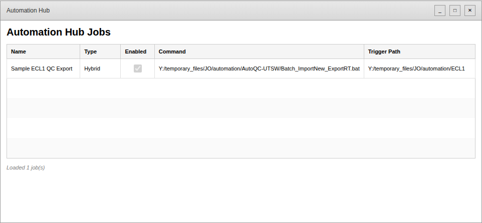

# Automation Hub

Automation Hub is a WPF desktop utility that centralizes automation jobs for the JO lab. It provides a single GUI to enable/disable jobs, inspect schedules, manually trigger scripts, and react to file-based events similar to AutoQC.

## Solution structure

| Project | Description |
|---------|-------------|
| **AutomationHub.App** | WPF front-end that lists jobs and will host control widgets. |
| **AutomationHub.Core** | Shared contracts for job definitions, configuration paths, and execution results. |
| **AutomationHub.Watchers** | File monitoring primitives that wrap `FileSystemWatcher` with filtering logic. |
| **AutomationHub.Scheduler** | Placeholder scheduler service that will evolve into a Quartz-based engine. |

Supporting assets:

- `config/jobs/sample-job.json` – starter job manifest.
- `requirements.md` – up-to-date installation and tooling checklist.

## Documentation and Screenshots

For detailed information about running and using the application:

- **[RUNNING_THE_APP.md](RUNNING_THE_APP.md)** – Complete guide on how to build, run, and configure the application
- **[PROCESS_EXECUTION.md](PROCESS_EXECUTION.md)** – Process execution and monitoring system with timeout protection and health checks
- **[UI_SCREENSHOTS.md](UI_SCREENSHOTS.md)** – Detailed UI specifications and visual mockups
- **[ui-mockup.html](ui-mockup.html)** – Interactive HTML mockup of the application interface
- **[docs/](docs/)** – Screenshots and additional documentation

### Application Preview



The application displays a data grid showing all configured automation jobs with their type, enabled status, command, and trigger path.

## Key Features

### Process Execution and Monitoring

Automation Hub includes a robust process execution system that ensures jobs run reliably:

- **✓ Startup Monitoring** - Verifies processes start successfully (checks for first 5 seconds)
- **✓ Timeout Protection** - Automatically terminates processes that exceed configured timeout (default: 60 minutes)
- **✓ Health Tracking** - Real-time monitoring of running jobs with status updates
- **✓ Stuck Detection** - Identifies jobs that may be hung or taking longer than expected
- **✓ Duplicate Prevention** - Ensures jobs don't run multiple instances concurrently
- **✓ Execution History** - Maintains audit trail of completed jobs (last 100 runs)
- **✓ Exit Code Tracking** - Captures process exit codes and execution duration
- **✓ Process Tree Cleanup** - Kills parent and all child processes on timeout or cancellation

See **[PROCESS_EXECUTION.md](PROCESS_EXECUTION.md)** for detailed documentation and usage examples.

## Getting started

1. Install the prerequisites listed in `requirements.md`.
2. Clone the repository and open `AutomationHub.sln` in Visual Studio or VS Code.
3. Restore dependencies and build:
   ```
   dotnet restore
   dotnet build
   ```
4. Launch the WPF project (`AutomationHub.App`) to see the sample job list loaded from the shared configuration directory.

## Next steps

- Port the AutoQC watcher logic into `AutomationHub.Watchers` for acquisition-aware file readiness checks.
- Integrate Quartz for accurate cron scheduling.
- Wire the GUI controls to scheduler + watcher services so jobs can be started/stopped interactively.
- Add persistence for runtime state (enable/disable flags, last-run status) using JSON or LiteDB files on `Y:`.
- Package the app using `dotnet publish` and distribute it on `Y:\temporary_files\JO\automation`.
