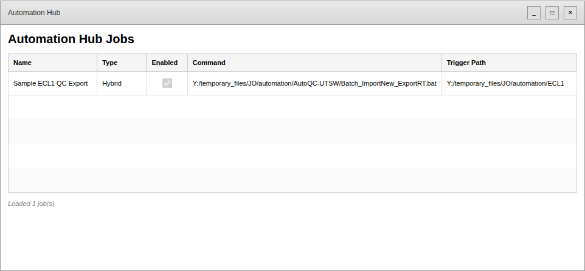

# Automation Hub

Automation Hub is a WPF desktop utility that centralizes automation jobs for the JO lab. It provides a single GUI to enable/disable jobs, inspect schedules, manually trigger scripts, and react to file-based events similar to AutoQC.

## Solution structure

| Project | Description |
|---------|-------------|
| **AutomationHub.App** | WPF front-end that lists jobs and will host control widgets. |
| **AutomationHub.Core** | Shared contracts for job definitions, configuration paths, and execution results. |
| **AutomationHub.Watchers** | File monitoring primitives that wrap `FileSystemWatcher` with filtering logic. |
| **AutomationHub.Scheduler** | Placeholder scheduler service that will evolve into a Quartz-based engine. |

Supporting assets:

- `config/jobs/sample-job.json` – starter job manifest.
- `requirements.md` – up-to-date installation and tooling checklist.

## Documentation and Screenshots

For detailed information about running and using the application:

- **[RUNNING_THE_APP.md](RUNNING_THE_APP.md)** – Complete guide on how to build, run, and configure the application
- **[PROCESS_EXECUTION.md](PROCESS_EXECUTION.md)** – Process execution and monitoring system with timeout protection and health checks
- **[UI_SCREENSHOTS.md](UI_SCREENSHOTS.md)** – Detailed UI specifications and visual mockups
- **[ui-mockup.html](ui-mockup.html)** – Interactive HTML mockup of the application interface
- **[docs/](docs/)** – Screenshots and additional documentation

### Application Preview



The application displays a data grid showing all configured automation jobs with their type, enabled status, command, and trigger path.

## Key Features

### Process Execution and Monitoring

Automation Hub includes a robust process execution system that ensures jobs run reliably:

- **✓ Startup Monitoring** - Verifies processes start successfully (checks for first 5 seconds)
- **✓ Timeout Protection** - Automatically terminates processes that exceed configured timeout (default: 60 minutes)
- **✓ Health Tracking** - Real-time monitoring of running jobs with status updates
- **✓ Stuck Detection** - Identifies jobs that may be hung or taking longer than expected
- **✓ Duplicate Prevention** - Ensures jobs don't run multiple instances concurrently
- **✓ Execution History** - Maintains audit trail of completed jobs (last 100 runs)
- **✓ Exit Code Tracking** - Captures process exit codes and execution duration
- **✓ Process Tree Cleanup** - Kills parent and all child processes on timeout or cancellation

See **[PROCESS_EXECUTION.md](PROCESS_EXECUTION.md)** for detailed documentation and usage examples.

### Automation Runtime 🕹️

Automation Hub now spins up a runtime host when the WPF app launches:

- **JobManifestLoader** reads every JSON job definition under `config/jobs` (or the shared `Y:` location) and reports schema errors without crashing the UI.
- **AutomationRuntimeHost** wires each enabled job into the execution pipeline:
   - File-triggered jobs get their own `FileTriggeredJobRunner`, which in turn uses `FileMonitoringService`.
   - Scheduled jobs are registered with the lightweight `JobSchedulerService` (minute-level polling for now). 
   - Manual jobs can still be launched through the monitor/orchestrator services.
- **ProcessMonitorService** continues to track running/completed executions so the UI (and future dashboards) can render health/state.
- **Job Settings Dialog** – Every row in the grid now has a _Settings…_ button. Users can edit the command, working directory, timeout, file-trigger folder/pattern/instrument, and acquisition minutes in-app. Saving writes the JSON back to disk and hot-reloads the runtime so new watchers take effect immediately.
- **Trigger File Argument Tokens** – For file-triggered jobs, the Process > Arguments field supports `{triggerFilePath}` and `{triggerFileName}` (also `%TRIGGER_FILE_PATH%` and `%TRIGGER_FILE_NAME%`). These are replaced at runtime with the file that triggered the run.
- **Add Job Button** – Use the _Add Job_ action in the header to create a brand-new manifest from the GUI. The app creates a default JSON file in the configured jobs directory and immediately opens the settings dialog so you can fill in details without touching the filesystem.
- **Per-job Activity Log** – Each job now includes a _View Log_ button that opens a live feed of watcher events, scheduled triggers, and process outcomes with timestamps. Use it to confirm that a file-triggered job fired moments ago and is now waiting for the next matching file.

### AutoQC-Style File Monitoring

To mirror ProteoWizard AutoQC behavior, file-trigger jobs now benefit from:

- A multi-filter engine: add as many `startsWith`, `endsWith`, `contains`, `regex`, or `All` tests as you need. They are combined with logical AND so you can require both the AutoQC prefix and the `.raw` suffix (or any other combination).
- Reuse of these filters for the initial scan and live events, so the job ignores staging files that do not pass your entire rule set.
- File-stability readiness: when a match is detected, Automation Hub waits for the file or directory to stay untouched for ~10 seconds before launching the job, reducing the chance of kicking off work while an instrument is still writing.
- Graceful status reporting when a watch folder on a network share is unavailable—the job stays listed but surfaces a runtime warning instead of crashing the app.

### Adding New Tasks

1. Drop a JSON manifest into `config/jobs/` (or the shared `Y:\temporary_files\JO\automation\config\jobs`).
2. Set `type` to any combination of `Manual`, `Scheduled`, and `FileTrigger`.
3. Provide `process.command`, `workingDirectory`, and optional environment/timeout metadata.
4. For file triggers, define `watchPath`, `includeSubfolders`, and a `filters` array (each entry specifies a `kind` + `pattern`). Combine filters to replicate AutoQC-style prefix + suffix matching.

#### Example: LUM1 HeLa Runtime Trigger

```
{
   "name": "JO LUM1 HeLa RT",
   "type": "FileTrigger",
   "enabled": true,
   "process": {
      "command": "Y:/temporary_files/JO/automation/JO_LUM1_HeLa_RT.bat",
      "workingDirectory": "Y:/temporary_files/JO/automation",
      "timeoutMinutes": 120
   },
   "fileTrigger": {
      "watchPath": "Y:/msdata/2026/2026_01/LUM1",
      "includeSubfolders": false,
      "filters": [
         {
            "kind": "startsWith",
            "pattern": "LUM1_HeLa_"
         },
         {
            "kind": "endsWith",
            "pattern": ".raw"
         }
      ]
   }
}
```

When a new `LUM1_HeLa_*.raw` dataset lands in `Y:\msdata\2026\2026_01\LUM1`, the runner waits briefly for the file to settle and then launches `JO_LUM1_HeLa_RT.bat`. Any issues (missing folder, invalid JSON, etc.) are surfaced in the status bar so you immediately know which jobs need attention.

### Multi-command batch workflows

Point `process.command` at a `.bat` file whenever you need to chain multiple commands (e.g., Skyline imports, report exports, and RoboCopy steps). Windows executes the batch file top-to-bottom, so you can encapsulate everything once in `config/jobs`:

```
cd C:\Users\s131945\AppData\Local\Apps\2.0\QQ4WYVGA.7BT\Q8666ON1.9TJ\skyl..tion_2e441fc3bf6adc7f_0017.0001_f0a1d88b2514a5aa
set yyyy=%date:~10,5%
set mm=%date:~4,2%
SkylineCmd.exe --in="Y:/temporary_files/JO/bckup_proc_pc/E/AutoQC-UTSW/LUM1/Skyline AutoQC Lumos1.sky" --import-all="Y:/msdata/2026/%yyyy%_%mm%/LUM1" --import-filename-pattern="LUM1_HeLa_*" --save
SkylineCmd.exe --in="Y:/temporary_files/JO/bckup_proc_pc/E/AutoQC-UTSW/LUM1/Skyline AutoQC Lumos1.sky" --report-name=JoeReport --report-conflict-resolution=overwrite --report-file="Y:/temporary_files/JO/bckup_proc_pc/E/AutoQC-UTSW/LUM1/LUM1_RT_Export.csv"
robocopy "Y:/temporary_files/JO/bckup_proc_pc/E/AutoQC-UTSW/LUM1" "Y:/temporary_files/JO/bckup_proc_pc/E/AutoQC-UTSW/RetentionTimeExports" LUM1_RT_Export.csv
robocopy "Y:/temporary_files/JO/bckup_proc_pc/E/AutoQC-UTSW/RetentionTimeExports" "Y:/temporary_files/JO/RetentionTimeExports2"
```

The GUI only needs to know the batch file path; the file itself can set environment variables, call SkylineCmd twice, and copy results to multiple folders without additional tooling.

### Job Activity Log

Pick any job row and click **View Log** to open a streaming activity window. The log captures:

- File trigger lifecycle events (watcher started, waiting for files, detection of specific filenames)
- Manual or scheduled kicks as soon as they occur
- Process completion status directly from the orchestrator (success/failure messages)

Entries are timestamped and retained in-memory (latest ~200 per job). Use this window to answer “what is this job doing right now?” without digging through the filesystem.

## Getting started

### For End Users (Running the Application)

If you just want to use Automation Hub:

1. Download the installer or portable package (see [Releases](https://github.com/jjjotto/automation-hub/releases))
2. Run the installer and follow the prompts, or extract the portable ZIP
3. See **[BUILDING_INSTALLER.md](BUILDING_INSTALLER.md)** for distribution details

### For Developers (Building from Source)

1. Install the prerequisites listed in `requirements.md`.
2. Clone the repository and open `AutomationHub.sln` in Visual Studio or VS Code.
3. Restore dependencies and build:
   ```
   dotnet restore
   dotnet build
   ```
4. Launch the WPF project (`AutomationHub.App`) to see the sample job list loaded from the shared configuration directory.

### Building an Installer

To create a distributable installer:

1. **Windows Installer (Recommended)**: Run `build-installer.bat` or `build-installer.ps1`
2. **Portable ZIP**: Run `build-portable.ps1`

See **[BUILDING_INSTALLER.md](BUILDING_INSTALLER.md)** for detailed instructions.

## Next steps

- Port the AutoQC watcher logic into `AutomationHub.Watchers` for acquisition-aware file readiness checks.
- Integrate Quartz for accurate cron scheduling.
- Wire the GUI controls to scheduler + watcher services so jobs can be started/stopped interactively.
- Add persistence for runtime state (enable/disable flags, last-run status) using JSON or LiteDB files on `Y:`.

## Distribution

See **[BUILDING_INSTALLER.md](BUILDING_INSTALLER.md)** for instructions on creating installers and distributing the application.
